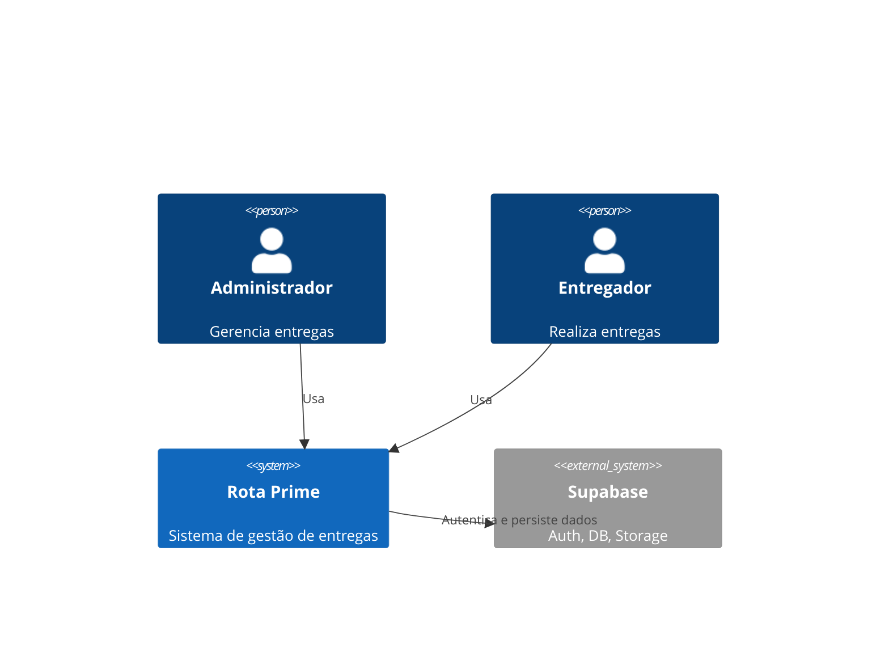
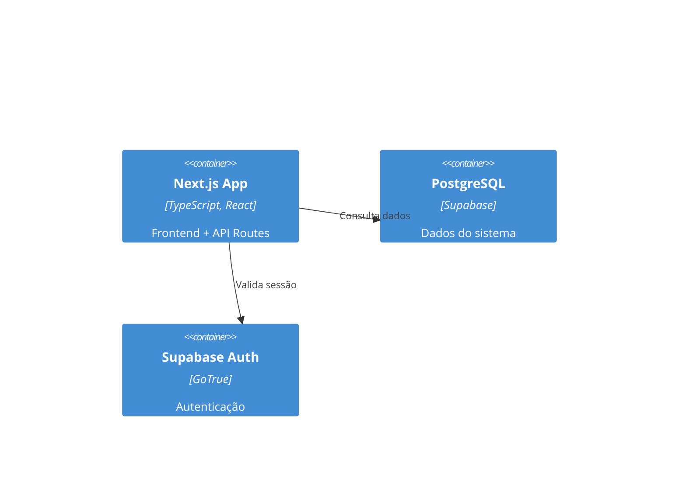

# TDD-XXX: [Nome do Projeto/Sistema]

**Status**: Draft | Approved | Superseded
**Versão**: 1.0
**Data**: YYYY-MM-DD
**Responsável**: Tech Lead / Arquiteto
**Referência**: [PRD-XXX](prd-template.md) — Seções [RF-0X, RNF-0X]

---

## 1. Arquitetura Geral do Sistema
[Descrição da arquitetura: Clean Architecture, Hexagonal, Modular, etc.]

### Diagrama C4 (Contexto)


### Diagrama de Containers


## 2. Stack Tecnológica
| Camada | Tecnologia | Versão | TypeScript |
|--------|-----------|--------|------------|
| Frontend | Next.js 14 (App Router) | ^14.2 | ✅ Strict |
| Estilos | Tailwind CSS 4 | ^4.3 | ✅ |
| UI | shadcn/ui + Base UI | - | ✅ |
| Banco | PostgreSQL (Supabase) | - | ✅ (via types) |
| Auth | Supabase Auth + JWT (jose) | - | ✅ |
| Mapas | Leaflet + react-leaflet | - | ✅ (types) |
| PDF | jsPDF + jspdf-autotable | - | ✅ |

## 3. Modelos de Dados (TypeScript Interfaces)

### Pacote
```typescript
interface Pacote {
  codigo: string           // PK, ex: "RP-2024-0001"
  destinatario: string
  endereco: string
  bairro: string
  cidade: string
  status: StatusPacote
  valor_repasse?: number
  foto_entrega?: string    // URL Supabase Storage
  gps_lat?: number
  gps_lng?: number
  entregador_id?: string   // FK => entregador.id
  transportadora_id?: string
  data_entrega?: Date
  created_at: Date
  updated_at: Date
}

type StatusPacote = 'pendente' | 'em_transporte' | 'entregue' | 'retornado'
```

### Entregador
```typescript
interface Entregador {
  id: string
  nome: string
  telefone: string
  chave_pix?: string
  valor_padrao_repasse: number
  ativo: boolean
  created_at: Date
}
```

### Ciclo de Pagamento
```typescript
interface CicloPagamento {
  id: string
  periodo_inicio: Date
  periodo_fim: Date
  status: 'aberto' | 'fechado' | 'pago'
  valor_total: number
  observacao?: string
}
```

[Continuar com demais modelos: Transportadora, Configuracao, LogAcao, etc.]

## 4. API Contracts

### API Routes (Next.js App Router)
Todas as rotas são implementadas como Route Handlers do Next.js 14.

| Método | Rota | Descrição | Auth |
|--------|------|-----------|------|
| POST | /api/auth/login | Login admin/entregador | Público |
| POST | /api/auth/logout | Logout | Sessão |
| GET | /api/auth/check | Verificar sessão | Sessão |
| GET | /api/auth/token | Refresh CSRF token | Sessão |
| GET | /api/admin/stats | Dashboard admin | Admin |
| GET | /api/pacotes | Listar pacotes | Sessão |
| POST | /api/pacotes | Criar pacote | Admin |
| ... | ... | ... | ... |

## 5. Estratégia de Deploy e CI/CD
- **Plataforma**: Vercel
- **CI**: GitHub Actions
  - `tsc --noEmit` (TypeScript check)
  - `next lint`
  - Build
  - Deploy automático na Vercel (production branch: `main`)
- **Ambientes**: Production (main) + Preview (PRs)

## 6. Considerações de Segurança
- CSRF via JWT (jose)
- Rate limiting nas rotas de login
- Proteção mass assignment
- Timeout de sessão
- RLS (Row Level Security) no Supabase

## 7. Decomposição em Domínios

### Domínio 1: Autenticação e Sessão
- Login admin e entregador
- CSRF token
- Impersonação (admin assume entregador)

### Domínio 2: Gestão de Pacotes
- CRUD pacotes
- Status tracking
- Upload de fotos
- Relatórios

### Domínio 3: Financeiro
- Ciclos de pagamento
- Repasses por entregador
- Dashboard financeiro
- Relatório mensal

### Domínio 4: Entregadores
- CRUD entregadores
- Valor padrão de repasse
- Métricas individuais

### Domínio 5: Configurações e Controle
- Feature flags (39 toggles)
- Predefinições globais
- Finalização de dia

## 8. Riscos Técnicos e Mitigações
| Risco | Impacto | Probabilidade | Mitigação |
|-------|---------|---------------|-----------|
| Supabase rate limit | Alto | Média | Cache + retry |
| Upload de fotos grande | Médio | Alta | sharp para compressão |
| Concorrência em finalizar dia | Alto | Baixa | Lock otimista |

## 9. Próximos Passos
1. Gerar Build Specs (prioridade: Autenticação > Pacotes > Financeiro)
2. Implementar seguindo as specs

---

**Histórico de Revisões**
| Versão | Data | Autor | Mudanças |
|--------|------|-------|----------|
| 1.0 | YYYY-MM-DD | [Nome] | Criação inicial |
